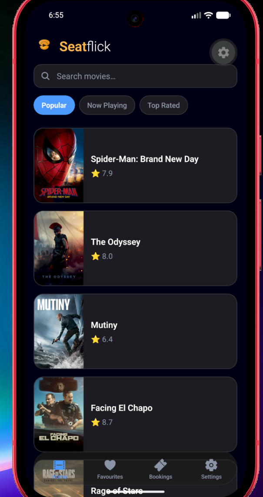
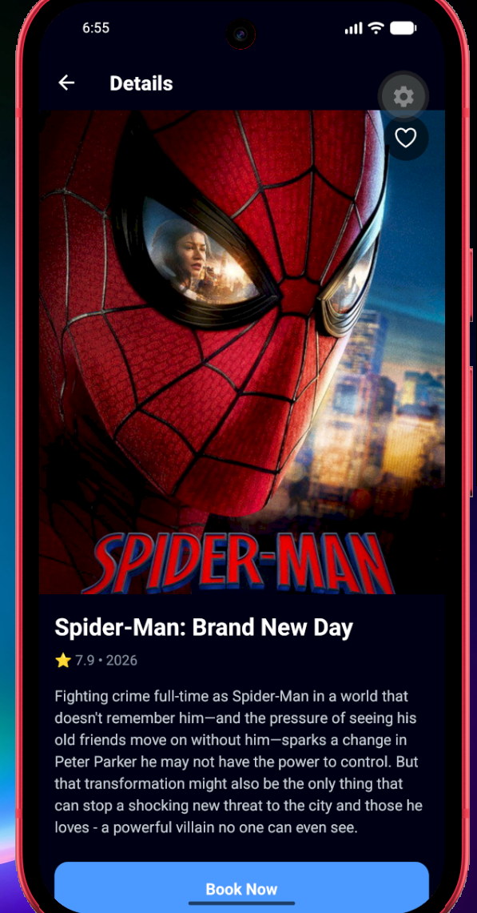
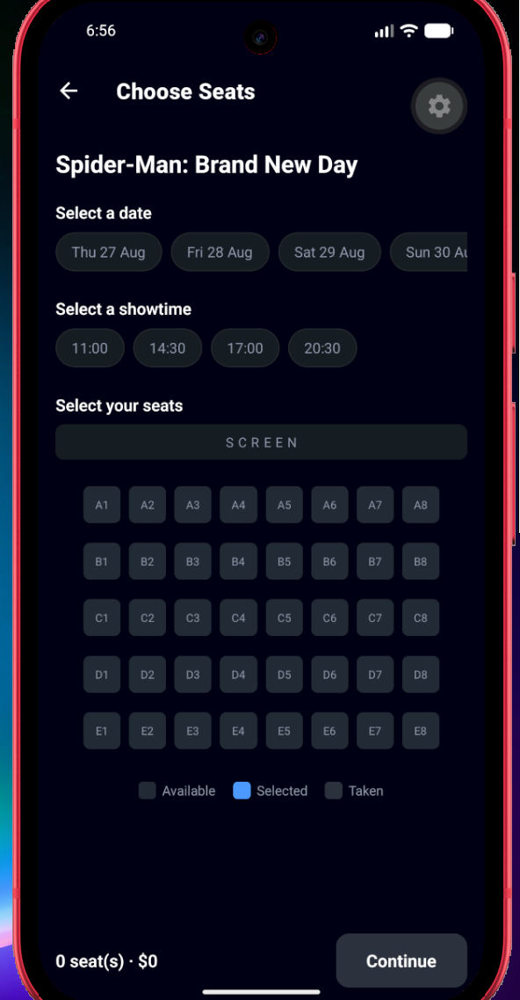
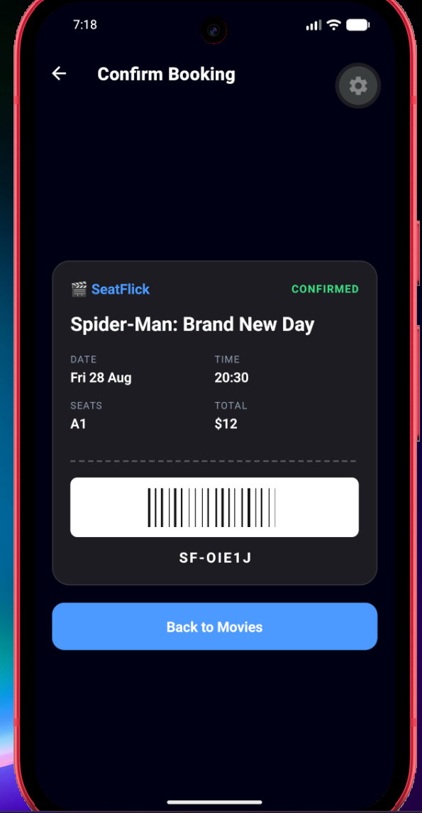
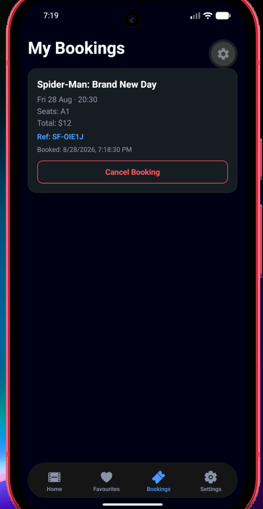
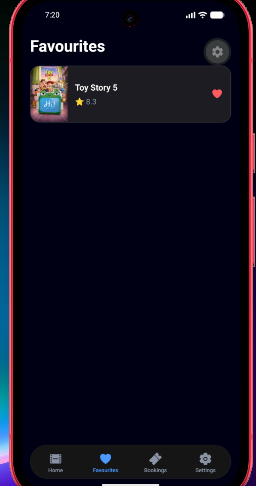
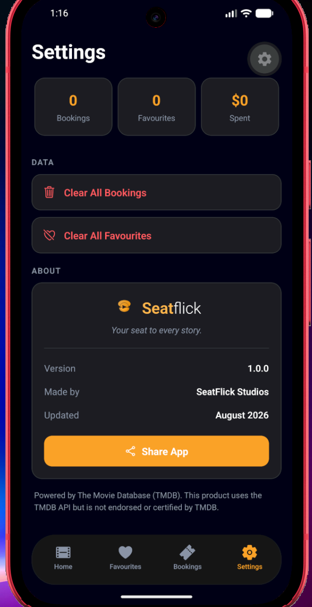
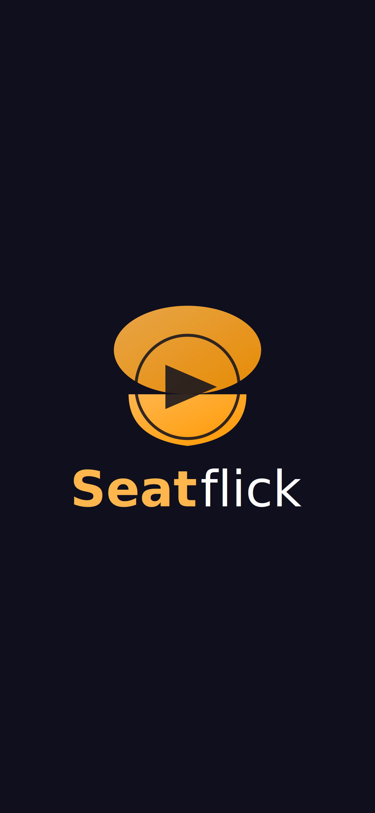

# SeatFlick


**SeatFlick** is a mobile cinema booking app built with React Native and Expo. Browse movies pulled live from The Movie Database (TMDB), pick a date, showtime and seats, and save your bookings and favourites on the device so they persist between sessions — all wrapped in a dark, frosted-glass interface.

> _Your seat to every story._

---

## Features

|     | Feature                    | Description                                                                              |
| --- | -------------------------- | ---------------------------------------------------------------------------------------- |
| 🎞️  | **Browse & categories**    | Live movie lists from TMDB, switchable between _Popular_, _Now Playing_ and _Top Rated_. |
| 🔍  | **Live search**            | Filter the movie list in real time as you type.                                          |
| 📄  | **Movie details**          | Poster, release year, rating and synopsis for each film.                                 |
| ❤️  | **Favourites**             | Save movies with a tap; they live on their own tab and persist between sessions.         |
| 🎟️  | **Seat booking**           | Pick a date (next 7 days), a showtime, and seats from an interactive grid.               |
| 🚫  | **Taken-seat detection**   | Seats already booked for the same showing are greyed out and locked.                     |
| 🧾  | **Ticket confirmation**    | A styled cinema ticket with a unique reference code and barcode.                         |
| 📋  | **My Bookings**            | All confirmed bookings saved locally, each cancellable individually.                     |
| ⚙️  | **Settings**               | Usage stats, clear-data controls, share, and app info.                                   |
| ⏳  | **Loading & error states** | Spinners while loading and friendly messages on network failure.                         |

---

## Installation & Run Instructions

### Prerequisites

- **Node.js** (LTS version — v22 recommended)
- **Expo Go** app on a physical device, **or** an **Android emulator** via Android Studio
- A free **TMDB API key** (see below)

### Setup

1. **Clone the repository**

   ```bash
   git clone https://github.com/YOUR-USERNAME/seatflick.git
   cd seatflick
   ```

2. **Install dependencies**

   ```bash
   npm install
   ```

3. **Add your TMDB API key**
   The key is kept out of the repository for security, so you'll need your own. In the project root, create a file named `.env` containing:

   ```
   TMDB_API_KEY=your_tmdb_api_key_here
   ```

   A key can be created for free at <https://www.themoviedb.org> under **Settings → API**. The app reads it automatically via `react-native-dotenv`.

4. **Start the app**
   ```bash
   npx expo start
   ```
   Then press **`a`** to open on an Android emulator, or scan the QR code with Expo Go on your phone.

---

## Screenshots

| Home                          | Movie Details                       | Seat Selection                  |
| ----------------------------- | ----------------------------------- | ------------------------------- |
|  |  |  |

| Ticket                            | My Bookings                           | Favourites                                |
| --------------------------------- | ------------------------------------- | ----------------------------------------- |
|  |  |  |

| Settings                              | Splash                            |
| ------------------------------------- | --------------------------------- |
|  |  |

---

## How It Works

A quick tour of the app's architecture and the decisions behind it:

- **Navigation (Expo Router).** Navigation is file-based. A root **stack** wraps a **bottom-tab** group (`Home`, `Favourites`, `Bookings`, `Settings`); tapping a movie pushes detail, seat and confirmation screens on top of the tabs. This combines tab and stack navigation in one structure.
- **State management (React Hooks).** Screen state (loading flags, the movie list, selected seats, search text, chosen category) is handled with `useState` and `useEffect`. `useFocusEffect` re-reads saved data whenever a tab regains focus, so lists stay current after a booking or favourite is added.
- **Persistence (AsyncStorage).** Two independent datasets — **bookings** and **favourites** — are serialised to on-device storage, so they survive the app being fully closed. All storage logic is isolated in `src/services/` rather than scattered through the screens.
- **Data & error handling (TMDB API).** All network calls live in `services/tmdb.js`. Every request shows a loading spinner and falls back to a friendly error message if the network or API key fails.
- **Seat availability.** When a date and showtime are chosen, the app checks existing bookings for that exact movie/date/time and disables any seats already taken — preventing double-booking per showing.
- **Theming.** A single `theme.js` palette drives every screen, keeping the dark, blue-accent look consistent and easy to change in one place.

---

## Technologies Used

- **React Native** — cross-platform mobile framework
- **Expo (SDK 54)** — tooling and runtime
- **Expo Router** — file-based navigation (bottom tabs + stack)
- **React Hooks** (`useState`, `useEffect`, `useCallback`, `useFocusEffect`) — state management
- **AsyncStorage** — local, on-device persistence for bookings and favourites
- **TMDB API** — live movie data
- **react-native-dotenv** — keeps the API key in a private `.env` file, out of the repository
- **react-native-svg** — the custom SeatFlick logo
- **expo-blur** — the frosted-glass navigation bar
- **@expo/vector-icons (Ionicons)** — interface icons
- **expo-splash-screen** — branded launch screen

---

## Project Structure

```
src/
├── app/
│   ├── _layout.tsx            # Root stack navigator
│   ├── (tabs)/                # Bottom tab screens
│   │   ├── _layout.tsx        # Tab bar (frosted glass)
│   │   ├── index.tsx          # Home (search + categories)
│   │   ├── favourites.tsx     # Saved favourites
│   │   ├── bookings.tsx       # Saved bookings
│   │   └── settings.tsx       # Settings (stats + about)
│   ├── movie/[id].tsx         # Movie details
│   ├── seats.tsx              # Date/time/seat selection
│   └── confirm.tsx            # Summary + ticket
├── components/
│   └── Logo.jsx               # SVG brand logo
├── services/
│   ├── tmdb.js                # API calls
│   ├── bookings.js            # Booking persistence
│   └── favourites.js          # Favourites persistence
└── theme.js                   # Central colour palette
```

---

## Known Issues & Future Improvements

- **Simulated payment** — the booking flow does not process real payments.
- **Edit bookings** — bookings can be cancelled and re-created, but not edited in place. Edit-in-place is a planned improvement.
- **Local-only availability** — taken seats are tracked per device, not on a shared server.
- **Expo Go splash** — when run through Expo Go, Expo Go's own loading screen appears before the app's branded splash. A standalone development build would show only the SeatFlick splash.
- **Planned additions** — cast lists, trailers, and pull-to-refresh.

---

## Reflection

This project was my introduction to React Native and the most challenging part of this learning journey was the environment itself, which was resolving a Node/npm version conflict during setup and an Expo SDK / Expo Go compatibility mismatch before the app would even run on a device. Once past that, building each feature gradually made the framework click as I learned how file-based routing combines stack and tab navigation, how React hooks manage screen state, and how AsyncStorage provides real-life persistence. Adding a second saved dataset (favourites) reinforced the pattern, and implementing taken-seat detection pushed me to think about data relationships rather than just displaying values. If I were to extend it, I'd move seat availability to a shared backend and add in-place booking edits.

---

## Attribution

Movie data provided by [The Movie Database (TMDB)](https://www.themoviedb.org). This product uses the TMDB API but is not endorsed or certified by TMDB.

---

_Built as a university project for the Mobile Applications module (UFCF7H-15-3)._
